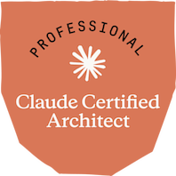

# Claude Certified Architect — Study Notes

Notes for the two Claude Certified Architect exams. Each note leads with a diagram or table, then explains, and ends with a quick-revision summary.

## Foundations - CCAR-F

1. [AI Fluency: Framework & Foundations](Foundations/01-AI-Fluency-Framework-and-Foundations/)
2. [Building with the Claude API](Foundations/02-Building-with-the-Claude-API/)
3. [Claude on Google Cloud](Foundations/03-Claude-on-Google-Cloud/)
4. [Claude Code in Action](Foundations/04-Claude-Code-in-Action/)

## Professional - CCAR-P

1. [Claude Platform & Solution Design](Professional/01-Claude-Platform-and-Solution-Design/)
2. [Enterprise Integration & Production](Professional/02-Enterprise-Integration-and-Production/)
3. [Responsible AI, Safety & Risk](Professional/03-Responsible-AI-Safety-and-Risk-for-Architects/)
4. [Stakeholder Engagement & GTM](Professional/04-Stakeholder-Engagement-Lifecycle-and-GTM/)
5. [Team Enablement & Ops](Professional/05-Team-Enablement-and-Operational-Productivity/)

---

I put these notes together while preparing for the Claude Certified Architect — Professional (CCAR-P) exam, which I’m happy to share I’ve [successfully cleared](https://www.credly.com/badges/dccf39e5-7132-40cf-a4c3-d4bbf5258660/public_url). 🎉

Sharing them here in the hope that they can make the preparation journey a little easier for others.
